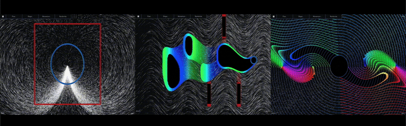

# Margo

is an **interactive software for solving level-set evolutions** (of Hamilton-Jacobi partial differential equations). More simply, this code ''flows'' a given shape.

Margo was built on [Field Play](https://github.com/anvaka/fieldplay), during which things were added (and broken).
Many thanks to previous developers for the flow visualization – @anvaka, @mourner, @skeeto – and HJ-solver – @ian-mitchell, @schmrlng – without whom this wouldnt exist.

NOTE (6/2025): there is a browser bug --> refresh once to workaround.

## About 

The level set is a shape that matches the zero-level of a function, called the value or energy. 
This value evolves based on a momentum, called the Hamiltonian. 

The flow, shape and momentum are **your choice**; *define them*.

We often choose the momentum to match a flow (aka vector-field) which models a dynamic system, e.g. jet flight. 
Thus, the **shape will move with the flow** *by default* (but can be made to do whatever).

## Controls

Click the screen before applying any of the following:

### Flow
- `f` – displays flow  
- `delete + f` – deletes the existing flow  

### Shape i.e., Boundary Condition (BC)
- `w` – displays coded BC  
- `i` & `o` – switches defining in/out BC (use `c` to see)  

### Momentum & Value
- `c` – fills BC & value interior  
- `l` – displays BC & value levels  
- `enter` – begins the value evolution  
- `delete + v` – deletes the existing value  

## Why

The momentum may be defined optimally with respect to control of the flow. The value evolution then reveals the best path, 
e.g. least time & most reward, to/from the shape and the corresponding optimal control actions.
In fact, solving or learning this evolution is how a modern robot guides itself 
(so maybe I am not the only one dreaming in shape).

I built this because I wanted a faster way to test and discuss new ideas, but also because I wanted to share the beauty of these evolutions. I would love to toy with this day and night but would need to clone myself, which is to say, contributions are more than welcome.

## How

The HJB value evolution is built on-top of the clever particle bank texture idea (described by @mourner [here](https://blog.mapbox.com/how-i-built-a-wind-map-with-webgl-b63022b5537f), improved by @anvaka). However, to evolve the value within this framework, we must resort to the traditional usage of textures as interpolators of structured data.

Hence, we define additional textures for (1) the user-defined boundary condition and (2) the corresponding evolved value. To evolve the value over the GPU parallelized framework, the numerical integration is (akin to the particles) is performed in an ''atomic'' fashion for each point in the texture. I have only had the time thus far to implement simple first-order integrators so you may notice some evolutions explode (in such a case, decrease timestep). 

To compute the value integration, the shaders query the texture for neighboring values to compute the finite differences (upwind), and pull in the user defined vector field, and then solve the HJB PDE's local value for dV/dt with these objects.

All in all, its relatively simple since no extra vectorization is needed (beyond GLSLs native ability), and to my surprise, pretty fast.

## To come

As of now, this is a limited proof-of-concept art exhibit. One will find many user-defined evolutions are unstable and explode, requiring more sophisticated algos (WENO5 implemented but needs testing). For now, use a smaller dt. Additionally, the observed speed suggests that this might be a feasible method for higher dimensions but that requires N-dimensional textures...

As I said before, contributions are welcomed.

## Examples

I added to @anvaka's query-state the shape and momentum definitions so all initial conditions may be shared with the link. For some inspiration, see below.

1. [box eye](https://willsharpless.github.io/margo/?cx=0.0029999999999998916&cy=0&w=4.006&h=4.006&dt=0.0005&fo=0.999&dp=0.000125&cm=1&bc=%2F%2F%20Given%20any%20state%2C%20we%20decide%20the%20initial%20value%20%28boundary%20condition%29%2C%0A%2F%2F%20defining%20a%20shape%20where%20the%20value%20is%20zero.%0A%0Afloat%20get_bc_reach%28vec2%20state%2C%20float%20sign%2C%20float%20time%29%20%7B%0A%0A%20%20float%20val%20%3D%20length%28state%29%20-%200.5%3B%20%2F%2F%20ball%0A%20%20%20%20%0A%20%20return%20val%3B%0A%7D%0A%20%20%0Afloat%20get_bc_avoid%28vec2%20state%2C%20float%20sign%2C%20float%20time%29%20%7B%0A%0A%20%20float%20val%20%3D%20max%28abs%28state.x%29%2C%20abs%28state.y%29%29%20-%201.0%3B%20%2F%2F%20box%0A%20%20%20%20%0A%20%20return%20-val%3B%0A%7D%0A%20%20%0Afloat%20get_bc%28vec2%20state%2C%20float%20sign%2C%20float%20time%29%20%7B%0A%0A%20%20float%20valR%20%3D%20get_bc_reach%28state%2C%20sign%2C%20time%29%3B%0A%20%20float%20valA%20%3D%20get_bc_avoid%28state%2C%20sign%2C%20time%29%3B%0A%20%20float%20val%20%3D%20max%28valR%2C%20-valA%29%3B%0A%20%20%20%20%0A%20%20return%20val%3B%0A%7D%0A%20%20%0A%2F%2F%20or%2C%20to%20draw%20it%2C%0A%2F%2F%20%5Bclick%20screen%2C%20%27d%27%2C%20click%20around%2C%20%27enter%27%5D&bccode=%2F%2F%20Given%20any%20state%2C%20we%20decide%20the%20initial%20value%20%28boundary%20condition%29%2C%0A%2F%2F%20defining%20a%20shape%20where%20the%20value%20is%20zero.%0A%0Afloat%20get_bc_reach%28vec2%20state%2C%20float%20sign%2C%20float%20time%29%20%7B%0A%0A%20%20float%20val%20%3D%20length%28state%29%20-%200.5%3B%20%2F%2F%20ball%0A%20%20%20%20%0A%20%20return%20val%3B%0A%7D%0A%20%20%0Afloat%20get_bc_avoid%28vec2%20state%2C%20float%20sign%2C%20float%20time%29%20%7B%0A%0A%20%20float%20val%20%3D%20max%28abs%28state.x%29%2C%20abs%28state.y%29%29%20-%201.0%3B%20%2F%2F%20box%0A%20%20%20%20%0A%20%20return%20-val%3B%0A%7D%0A%20%20%0Afloat%20get_bc%28vec2%20state%2C%20float%20sign%2C%20float%20time%29%20%7B%0A%0A%20%20float%20valR%20%3D%20get_bc_reach%28state%2C%20sign%2C%20time%29%3B%0A%20%20float%20valA%20%3D%20get_bc_avoid%28state%2C%20sign%2C%20time%29%3B%0A%20%20float%20val%20%3D%20max%28valR%2C%20-valA%29%3B%0A%20%20%20%20%0A%20%20return%20val%3B%0A%7D%0A%20%20%0A%2F%2F%20or%2C%20to%20draw%20it%2C%0A%2F%2F%20%5Bclick%20screen%2C%20%27d%27%2C%20click%20around%2C%20%27enter%27%5D&val=%2F%2F%20Given%20any%20state%2C%20we%20decide%20the%20momentum%20%28hamiltonian%29%2C%0A%2F%2F%20defining%20how%20the%20value%20evolves.%0A%0Afloat%20get_ham%28vec2%20state%2C%20vec2%20costate%2C%20float%20time%29%20%7B%0A%0A%20%20%2F%2F%20Control%0A%20%20float%20hamC%20%3D%20dot%28abs%28vec2%281.0%2C%200.0%29%20*%20costate%29%2C%20vec2%281.%29%29%3B%0A%0A%20%20%2F%2F%20Disturbance%0A%20%20float%20hamD%20%3D%20-dot%28abs%28vec2%280.0%2C%201.0%29%20*%20costate%29%2C%20vec2%281.%29%29%3B%0A%0A%20%20return%20-dot%28costate%2C%20get_vel%28state%29%29%20%2B%20hamC%20%2B%20hamD%3B%0A%7D%0A%0A%2F%2F%20we%20may%20also%20filter%20evolution%0Afloat%20filter_val%28float%20valNext%2C%20float%20val%2C%20float%20valR%2C%20float%20valA%29%20%7B%0A%0A%20%20return%20max%28min%28valNext%2C%20valR%29%2C%20-valA%29%3B%20%2F%2F%20BRAT%20%28set%20Dual%20in%20Shape...%29%0A%7D%0A%0A%2F%2F%20to%20see%20it%2C%0A%2F%2F%20%5Bclick%20screen%2C%20%27shift%27%20%2B%20%27enter%27%5D&valcode=%2F%2F%20Given%20any%20state%2C%20we%20decide%20the%20momentum%20%28hamiltonian%29%2C%0A%2F%2F%20defining%20how%20the%20value%20evolves.%0A%0Afloat%20get_ham%28vec2%20state%2C%20vec2%20costate%2C%20float%20time%29%20%7B%0A%0A%20%20%2F%2F%20Control%0A%20%20float%20hamC%20%3D%20dot%28abs%28vec2%281.0%2C%200.0%29%20*%20costate%29%2C%20vec2%281.%29%29%3B%0A%0A%20%20%2F%2F%20Disturbance%0A%20%20float%20hamD%20%3D%20-dot%28abs%28vec2%280.0%2C%201.0%29%20*%20costate%29%2C%20vec2%281.%29%29%3B%0A%0A%20%20return%20-dot%28costate%2C%20get_vel%28state%29%29%20%2B%20hamC%20%2B%20hamD%3B%0A%7D%0A%0A%2F%2F%20we%20may%20also%20filter%20evolution%0Afloat%20filter_val%28float%20valNext%2C%20float%20val%2C%20float%20valR%2C%20float%20valA%29%20%7B%0A%0A%20%20return%20max%28min%28valNext%2C%20valR%29%2C%20-valA%29%3B%20%2F%2F%20BRAT%20%28set%20Dual%20in%20Shape...%29%0A%7D%0A%0A%2F%2F%20to%20see%20it%2C%0A%2F%2F%20%5Bclick%20screen%2C%20%27shift%27%20%2B%20%27enter%27%5D&bcmode=3)

2. [swinging axes](https://willsharpless.github.io/margo/?dt=0.001&fo=0.999&dp=0.000125&cm=1&cx=-1.69655&cy=0.05835000000000001&w=4.7303&h=4.7303&bc=%2F%2F%20Given%20any%20state%2C%20we%20decide%20the%20initial%20value%20%28boundary%20condition%29%2C%0A%2F%2F%20defining%20a%20shape%20where%20the%20value%20is%20zero.%0A%0Afloat%20get_bc_reach%28vec2%20state%2C%20float%20sign%2C%20float%20time%29%20%7B%0A%0A%20%20float%20val%20%3D%20length%28state%29%20-%200.1%3B%20%2F%2F%20ball%0A%20%20%20%20%0A%20%20return%20val%3B%0A%7D%0A%20%20%0Afloat%20get_bc_avoid%28vec2%20state%2C%20float%20sign%2C%20float%20time%29%20%7B%0A%0A%20%20float%20val%20%3D%20max%28abs%285.*%28state.x%2B0.5%29%29%2C%20abs%28state.y%20%2B%20cos%280.005%20*%20frame%29%29%29%20-%200.3%3B%20%2F%2F%20box%0A%20%20float%20val2%20%3D%20max%28abs%285.*%28state.x%2B1.%29%29%2C%20abs%28state.y%20%2B%20cos%280.005%20*%20frame%20%2B%203.14%29%29%29%20-%200.3%3B%20%2F%2F%20box%0A%20%20float%20val3%20%3D%20max%28abs%285.*%28state.x%2B1.5%29%29%2C%20abs%28state.y%20%2B%20cos%280.005%20*%20frame%29%29%29%20-%200.3%3B%20%2F%2F%20box%0A%20%20%20%20%0A%20%20return%20min%28min%28val%2C%20val2%29%2C%20val3%29%3B%0A%7D%0A%20%20%0Afloat%20get_bc%28vec2%20state%2C%20float%20sign%2C%20float%20time%29%20%7B%0A%0A%20%20float%20valR%20%3D%20get_bc_reach%28state%2C%20sign%2C%20time%29%3B%0A%20%20float%20valA%20%3D%20get_bc_avoid%28state%2C%20sign%2C%20time%29%3B%0A%20%20float%20val%20%3D%20max%28valR%2C%20-valA%29%3B%0A%20%20%20%20%0A%20%20return%20val%3B%0A%7D%0A%20%20%0A%2F%2F%20to%20see%20it%2C%0A%2F%2F%20%5Bclick%20screen%2C%20%27w%27%5D&bccode=%2F%2F%20Given%20any%20state%2C%20we%20decide%20the%20initial%20value%20%28boundary%20condition%29%2C%0A%2F%2F%20defining%20a%20shape%20where%20the%20value%20is%20zero.%0A%0Afloat%20get_bc_reach%28vec2%20state%2C%20float%20sign%2C%20float%20time%29%20%7B%0A%0A%20%20float%20val%20%3D%20length%28state%29%20-%200.1%3B%20%2F%2F%20ball%0A%20%20%20%20%0A%20%20return%20val%3B%0A%7D%0A%20%20%0Afloat%20get_bc_avoid%28vec2%20state%2C%20float%20sign%2C%20float%20time%29%20%7B%0A%0A%20%20float%20val%20%3D%20max%28abs%285.*%28state.x%2B0.5%29%29%2C%20abs%28state.y%20%2B%20cos%280.005%20*%20frame%29%29%29%20-%200.3%3B%20%2F%2F%20box%0A%20%20float%20val2%20%3D%20max%28abs%285.*%28state.x%2B1.%29%29%2C%20abs%28state.y%20%2B%20cos%280.005%20*%20frame%20%2B%203.14%29%29%29%20-%200.3%3B%20%2F%2F%20box%0A%20%20float%20val3%20%3D%20max%28abs%285.*%28state.x%2B1.5%29%29%2C%20abs%28state.y%20%2B%20cos%280.005%20*%20frame%29%29%29%20-%200.3%3B%20%2F%2F%20box%0A%20%20%20%20%0A%20%20return%20min%28min%28val%2C%20val2%29%2C%20val3%29%3B%0A%7D%0A%20%20%0Afloat%20get_bc%28vec2%20state%2C%20float%20sign%2C%20float%20time%29%20%7B%0A%0A%20%20float%20valR%20%3D%20get_bc_reach%28state%2C%20sign%2C%20time%29%3B%0A%20%20float%20valA%20%3D%20get_bc_avoid%28state%2C%20sign%2C%20time%29%3B%0A%20%20float%20val%20%3D%20max%28valR%2C%20-valA%29%3B%0A%20%20%20%20%0A%20%20return%20val%3B%0A%7D%0A%20%20%0A%2F%2F%20to%20see%20it%2C%0A%2F%2F%20%5Bclick%20screen%2C%20%27w%27%5D&val=%2F%2F%20Given%20any%20state%2C%20we%20decide%20the%20momentum%20%28hamiltonian%29%2C%0A%2F%2F%20defining%20how%20the%20value%20evolves.%0A%0Afloat%20get_ham%28vec2%20state%2C%20vec2%20costate%2C%20float%20time%29%20%7B%0A%0A%20%20%2F%2F%20Control%0A%20%20float%20hamC%20%3D%20dot%28abs%28vec2%280.0%2C%200.5%29%20*%20costate%29%2C%20vec2%281.%29%29%3B%0A%0A%20%20%2F%2F%20Disturbance%0A%20%20float%20hamD%20%3D%20-dot%28abs%28vec2%280.0%2C%200.1%29%20*%20costate%29%2C%20vec2%281.%29%29%3B%0A%0A%20%20return%20-dot%28costate%2C%20get_vel%28state%29%29%20%2B%20hamC%20%2B%20hamD%3B%0A%7D%0A%0A%2F%2F%20we%20may%20also%20filter%20evolution%0Afloat%20filter_val%28float%20valNext%2C%20float%20val%2C%20float%20valR%2C%20float%20valA%29%20%7B%0A%0A%20%20return%20max%28min%28valNext%2C%20valR%29%2C%20-valA%29%3B%20%2F%2F%20BRAT%20%28set%20Dual%20in%20Shape...%29%0A%7D%0A%0A%2F%2F%20to%20see%20it%2C%0A%2F%2F%20%5Bclick%20screen%2C%20%27enter%27%5D&valcode=%2F%2F%20Given%20any%20state%2C%20we%20decide%20the%20momentum%20%28hamiltonian%29%2C%0A%2F%2F%20defining%20how%20the%20value%20evolves.%0A%0Afloat%20get_ham%28vec2%20state%2C%20vec2%20costate%2C%20float%20time%29%20%7B%0A%0A%20%20%2F%2F%20Control%0A%20%20float%20hamC%20%3D%20dot%28abs%28vec2%280.0%2C%200.5%29%20*%20costate%29%2C%20vec2%281.%29%29%3B%0A%0A%20%20%2F%2F%20Disturbance%0A%20%20float%20hamD%20%3D%20-dot%28abs%28vec2%280.0%2C%200.1%29%20*%20costate%29%2C%20vec2%281.%29%29%3B%0A%0A%20%20return%20-dot%28costate%2C%20get_vel%28state%29%29%20%2B%20hamC%20%2B%20hamD%3B%0A%7D%0A%0A%2F%2F%20we%20may%20also%20filter%20evolution%0Afloat%20filter_val%28float%20valNext%2C%20float%20val%2C%20float%20valR%2C%20float%20valA%29%20%7B%0A%0A%20%20return%20max%28min%28valNext%2C%20valR%29%2C%20-valA%29%3B%20%2F%2F%20BRAT%20%28set%20Dual%20in%20Shape...%29%0A%7D%0A%0A%2F%2F%20to%20see%20it%2C%0A%2F%2F%20%5Bclick%20screen%2C%20%27enter%27%5D&vf=%2F%2F%20Given%20any%20point%20%28state%29%2C%20we%20decide%20how%20it%20moves%20%28velocity%29%2C%0A%2F%2F%20defining%20how%20space%20flows.%0A%0Avec2%20get_vel%28vec2%20s%29%20%7B%0A%0A%20%20vec2%20v%20%3D%20vec2%280.%2C%200.%29%3B%0A%0A%20%20v.x%20%3D%201.%3B%0A%20%20v.y%20%3D%20cos%285.%20*%20s.x%29%3B%0A%0A%20%20return%20v%3B%0A%7D%0A%20%20%0A%2F%2F%20to%20see%20it%2C%0A%2F%2F%20%5Bclick%20screen%2C%20%27f%27%5D&code=%2F%2F%20Given%20any%20point%20%28state%29%2C%20we%20decide%20how%20it%20moves%20%28velocity%29%2C%0A%2F%2F%20defining%20how%20space%20flows.%0A%0Avec2%20get_vel%28vec2%20s%29%20%7B%0A%0A%20%20vec2%20v%20%3D%20vec2%280.%2C%200.%29%3B%0A%0A%20%20v.x%20%3D%201.%3B%0A%20%20v.y%20%3D%20cos%285.%20*%20s.x%29%3B%0A%0A%20%20return%20v%3B%0A%7D%0A%20%20%0A%2F%2F%20to%20see%20it%2C%0A%2F%2F%20%5Bclick%20screen%2C%20%27f%27%5D&bcmode=3)

3. [magic graffiti](https://willsharpless.github.io/margo/?cx=-0.09550000000000036&cy=0.04064999999999985&w=15.6334&h=15.6334&dt=0.0005&fo=0.999&dp=0.000125&cm=1&vf=%2F%2F%20Given%20any%20point%20%28state%29%2C%20we%20decide%20how%20it%20moves%20%28velocity%29%2C%0A%2F%2F%20defining%20how%20space%20flows.%0A%0Avec2%20get_vel%28vec2%20s%29%20%7B%0A%0A%20%20vec2%20v%20%3D%20vec2%280.%2C%200.%29%3B%0A%0A%20%20v.x%20%3D%20s.y%3B%0A%20%20v.y%20%3D%20sin%28s.x%29%3B%0A%0A%20%20return%20v%3B%0A%7D%0A%20%20%0A%2F%2F%20to%20see%20it%2C%0A%2F%2F%20%5Bclick%20screen%2C%20%27f%27%5D&code=%2F%2F%20Given%20any%20point%20%28state%29%2C%20we%20decide%20how%20it%20moves%20%28velocity%29%2C%0A%2F%2F%20defining%20how%20space%20flows.%0A%0Avec2%20get_vel%28vec2%20s%29%20%7B%0A%0A%20%20vec2%20v%20%3D%20vec2%280.%2C%200.%29%3B%0A%0A%20%20v.x%20%3D%20s.y%3B%0A%20%20v.y%20%3D%20sin%28s.x%29%3B%0A%0A%20%20return%20v%3B%0A%7D%0A%20%20%0A%2F%2F%20to%20see%20it%2C%0A%2F%2F%20%5Bclick%20screen%2C%20%27f%27%5D&val=%2F%2F%20Given%20any%20state%2C%20we%20decide%20the%20momentum%20%28hamiltonian%29%2C%0A%2F%2F%20defining%20how%20the%20value%20evolves.%0A%0Afloat%20get_ham%28vec2%20state%2C%20vec2%20costate%2C%20float%20time%29%20%7B%0A%0A%20%20%2F%2F%20Control%0A%20%20float%20hamC%20%3D%20dot%28abs%28vec2%280.1%2C%200.1%29%20*%20costate%29%2C%20vec2%281.%29%29%3B%0A%0A%20%20return%20-dot%28costate%2C%20get_vel%28state%29%29%20%2B%20hamC%3B%0A%7D%0A%0A%2F%2F%20we%20may%20also%20filter%20evolution%0Afloat%20filter_val%28float%20valNext%2C%20float%20val%2C%20float%20valR%2C%20float%20valA%29%20%7B%0A%0A%20%20return%20min%28valNext%2C%20val%29%3B%20%2F%2F%20BRT%2FBAT%0A%7D%0A%0A%2F%2F%20to%20see%20it%2C%0A%2F%2F%20%5Bclick%20screen%2C%20%27enter%27%5D&valcode=%2F%2F%20Given%20any%20state%2C%20we%20decide%20the%20momentum%20%28hamiltonian%29%2C%0A%2F%2F%20defining%20how%20the%20value%20evolves.%0A%0Afloat%20get_ham%28vec2%20state%2C%20vec2%20costate%2C%20float%20time%29%20%7B%0A%0A%20%20%2F%2F%20Control%0A%20%20float%20hamC%20%3D%20dot%28abs%28vec2%280.1%2C%200.1%29%20*%20costate%29%2C%20vec2%281.%29%29%3B%0A%0A%20%20return%20-dot%28costate%2C%20get_vel%28state%29%29%20%2B%20hamC%3B%0A%7D%0A%0A%2F%2F%20we%20may%20also%20filter%20evolution%0Afloat%20filter_val%28float%20valNext%2C%20float%20val%2C%20float%20valR%2C%20float%20valA%29%20%7B%0A%0A%20%20return%20min%28valNext%2C%20val%29%3B%20%2F%2F%20BRT%2FBAT%0A%7D%0A%0A%2F%2F%20to%20see%20it%2C%0A%2F%2F%20%5Bclick%20screen%2C%20%27enter%27%5D&bc=%2F%2F%20Given%20any%20state%2C%20we%20decide%20the%20initial%20value%20%28boundary%20condition%29%2C%0A%2F%2F%20defining%20a%20shape%20where%20the%20value%20is%20zero.%0A%0Afloat%20get_bc%28vec2%20state%2C%20float%20sign%2C%20float%20time%29%20%7B%0A%0A%20%20float%20val%20%3D%20length%28state%29%20-%201.0%3B%20%2F%2F%20ball%0A%20%20%20%20%0A%20%20return%20val%3B%0A%7D%0A%20%20%0A%2F%2F%20to%20see%20it%2C%0A%2F%2F%20%5Bclick%20screen%2C%20%27w%27%5D&bccode=%2F%2F%20Given%20any%20state%2C%20we%20decide%20the%20initial%20value%20%28boundary%20condition%29%2C%0A%2F%2F%20defining%20a%20shape%20where%20the%20value%20is%20zero.%0A%0Afloat%20get_bc%28vec2%20state%2C%20float%20sign%2C%20float%20time%29%20%7B%0A%0A%20%20float%20val%20%3D%20length%28state%29%20-%201.0%3B%20%2F%2F%20ball%0A%20%20%20%20%0A%20%20return%20val%3B%0A%7D%0A%20%20%0A%2F%2F%20to%20see%20it%2C%0A%2F%2F%20%5Bclick%20screen%2C%20%27w%27%5D)

